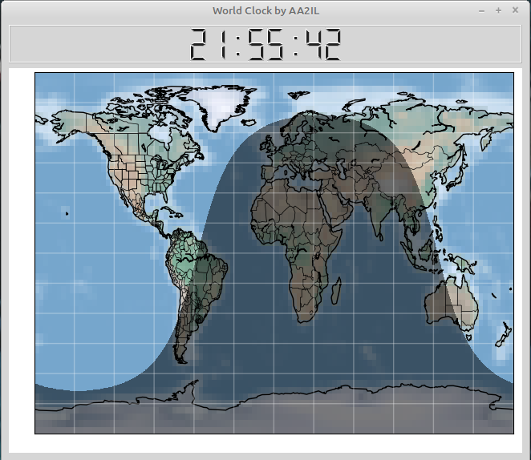

# World Clock

Clock showing GMT time and Gray Line.

# Installation under Linux using uv:

0. This seems to be the easiest/best solution.  You will need to install uv on your system (once):

        curl -LsSf https://astral.sh/uv/install.sh | sh      
        rehash     

1. Clone gitub wclock, libs and data repositories
      
        cd
        mkdir Python
        cd Python
        git clone https://github.com/aa2il/wclock
        git clone https://github.com/aa2il/libs
        git clone https://github.com/aa2il/data

2. One of the features of uv is that the virtual environment is included in the github repository.  You DO NOT have to do anything since uv will install the environment and required packages the first time you run wclock.

   For the record, here is how I set up the environment:

        cd ~/Python/wclock
        uv init
        rm main.py
        uv add -r requirements.txt

        Note: wclock.py uses qt, not tk, so there is no problem with the recent versions of python (e.g. 3.13) except on an RPi.

3. NOTE: There seems to be a few bugs in uv on the RPi.
   
   First, if we use PySide6, we can use recent versions of Python;
   BUT, if we use pyqt6, we can't:
         
        rm -rf uv.lock pyproject.toml .venv .python-version
        uv init --python 3.11

   or

        uv python pin 3.11

   To get pyqt6 installed, we need to use
         
        uv pip install -r requirements.txt
   
4. Make sure its executable and set PYTHON PATH so os can find libraries:

        cd ~/Python/wclock
        chmod +x wclock.py

        Under tcsh:      setenv PYTHONPATH $HOME/Python/libs
        Under bash:      export PYTHONPATH="$HOME/Python/libs"
   
5. Bombs away:

        uv run wclock.py

   or, 

        ./wclock.py

6. Other useful uv commands:

   - Get a list of available python interpretors:
   
          uv python list

   - Install a specific python version:
   
          uv python install 3.13

   - Use (pin) a specific version:
   
          uv python pin 3.13

   - Add (remove) a package:

          uv add numpy

   - Remove an existing uv installation and start from scratch:
        
        rm -rf uv.lock pyproject.toml .venv .python-version

   - Help:

          uv --help

# Installation for Windoz using uv:

0. This couldn't be much easier - and there's no need for a bulky installer!  You will need to install uv on your system by opening a cmd prompt and executing:

        powershell -ExecutionPolicy ByPass -c "irm https://astral.sh/uv/install.ps1 | iex"

You will also need a git client.  I use the command line version available from:

        https://git-scm.com/downloads/win
       
1. Open a cmd prompt and clone gitub wclock, libs and data repositories

        cd %userprofile%
        mkdir Python
        cd Python
        git clone https://github.com/aa2il/wclock
        git clone https://github.com/aa2il/libs
        git clone https://github.com/aa2il/data

2. Run it - uv will magically rebuild the virtual environment the first time:

        cd wclock
        uv run wclock.py

# Other Installation Options

In the past, I have used other installation methods for both linux and windoz.  These are summarized in the companion file README2.md.

Additional note - to simply grab the latest changes, use "pull" instead of "clone" in the git commands:

        cd wclock
        git pull https://github.com/aa2il/wclock
        cd ../libs
        git pull https://github.com/aa2il/libs
        cd ../data
        git pull https://github.com/aa2il/data
        

